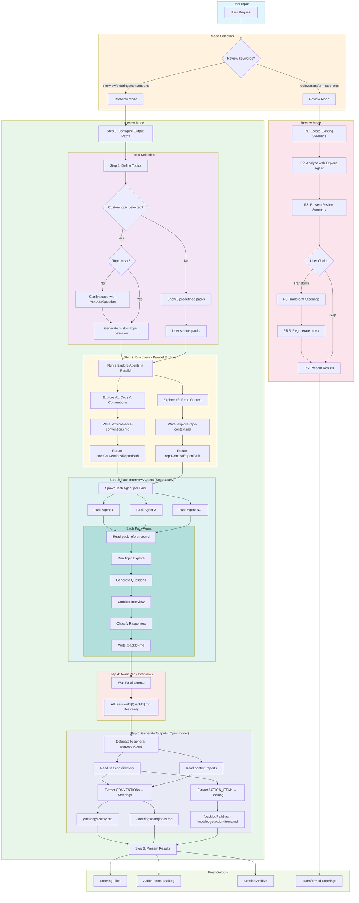

# Tacit Knowledge Extractor - Flow Diagram



## Key Components

### Mode Selection
- **Review Mode**: Transform existing steerings to standard format
- **Interview Mode**: Extract tacit knowledge through guided interviews

### Interview Flow Steps

| Step | Purpose | Key Output |
|------|---------|------------|
| 0 | Configure paths | `steeringsPath`, `sessionsPath`, `backlogPath` |
| 1 | Define topics | List of predefined packs and/or custom topics |
| 2 | Discovery | `explore-docs-conventions.md`, `explore-repo-context.md` |
| 3 | Pack Interview Agents | Spawn Task agent per pack (sequentally) |
| 4 | Await Interviews | All `{sessionId}/{packId}.md` files ready |
| 5 | Generation | Steering files + Action items backlog |
| 6 | Present | Summary of generated files |

### Report Files (Step 2)

```
{sessionsPath}/
├── explore-docs-conventions.md   # Explore #1 output
├── explore-repo-context.md       # Explore #2 output
└── {sessionId}/                  # Interview session directory
    ├── {packId-1}.md             # Pack 1 responses
    ├── {packId-2}.md             # Pack 2 responses
    └── ...
```

### Final Outputs

```
{steeringsPath}/
├── index.md
├── architecture-invariants.md
├── testing-strategy.md
└── {custom-topic}.md

{backlogPath}/
└── tacit-knowledge-action-items.md
```
